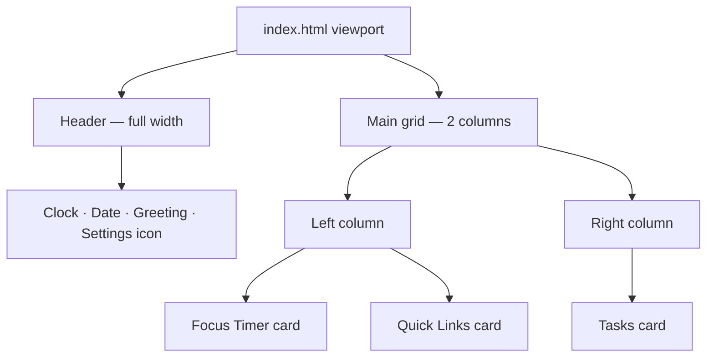
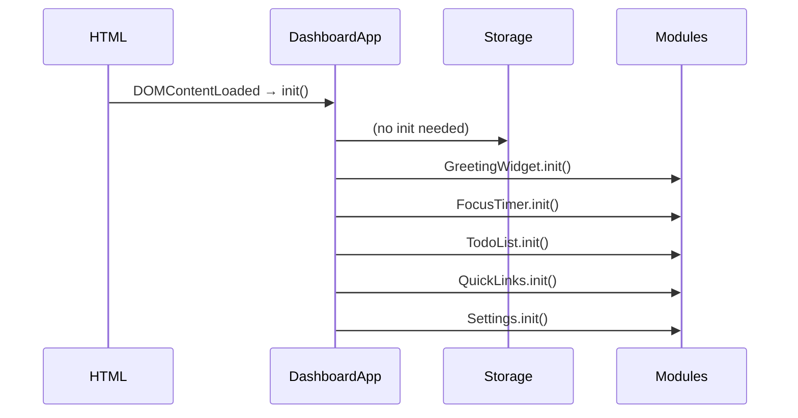

# Design Document: Todo Life Dashboard

## Overview

A single-page daily dashboard delivered as three static files (`index.html`, `css/styles.css`, `js/script.js`). No build step, no framework, no backend. All state lives in `localStorage`. The page is structured as a full-viewport layout with a header greeting zone and a two-column card grid below it.

The JavaScript is organized into self-contained module objects (namespaces) — one per feature — each exposing an `init()` function called from a single `DashboardApp.init()` entry point. DOM manipulation is kept inside each module; no module reaches into another module's DOM nodes.

---

## Architecture

```
index.html
  └── <link> css/styles.css
  └── <script> js/script.js

js/script.js
  ├── Storage        — thin localStorage wrapper
  ├── GreetingWidget — clock, date, greeting text
  ├── FocusTimer     — Pomodoro countdown
  ├── TodoList       — task CRUD + duplicate check
  ├── QuickLinks     — link CRUD
  ├── Settings       — theme toggle + custom name
  └── DashboardApp   — orchestrator, calls all init()
```

Data flow is strictly one-directional per module:

```
User interaction → Module handler → Storage.save() → Module.render()
```

No shared mutable state between modules. Each module reads its own slice of `localStorage` on `init()` and writes back on every mutation.

### Mermaid: Page Layout



### Mermaid: Module Initialization



---

## Components and Interfaces

### GreetingWidget

Owns the `<header>` section. Runs a `setInterval` every 1 000 ms to update the clock.

```js
GreetingWidget = {
  init(),                        // reads userName from Storage, starts clock interval
  _tick(),                       // called every second: updates time + greeting
  _getGreeting(hour),            // returns "Good Morning|Afternoon|Evening|Night"
  _formatTime(date),             // returns "HH:MM:SS"
  _formatDate(date),             // returns "Weekday, Month DD, YYYY"
  render(userName),              // updates DOM nodes for time, date, greeting
}
```

DOM targets: `#clock`, `#date`, `#greeting-text`

---

### FocusTimer

Owns the Focus Timer card. Uses a single `setInterval` reference stored in module scope.

```js
FocusTimer = {
  init(),                        // renders initial 25:00, binds button events
  start(),                       // starts interval if not already running
  stop(),                        // clears interval, retains remaining time
  reset(),                       // clears interval, resets remaining to 25:00
  _tick(),                       // decrements remaining, calls render, checks 00:00
  _formatTime(totalSeconds),     // returns "MM:SS"
  render(),                      // updates #timer-display
  _notifyComplete(),             // shows alert or inline message on 00:00
}
```

Internal state (module-scoped variables, not persisted):
- `remaining` — integer seconds, starts at 1500
- `intervalId` — reference to active `setInterval`, or `null`

DOM targets: `#timer-display`, `#btn-start`, `#btn-stop`, `#btn-reset`, `#timer-message`

---

### TodoList

Owns the Tasks card. Each task has a generated `id` (timestamp string).

```js
TodoList = {
  init(),                        // loads tasks from Storage, renders list, binds add-form
  _add(label),                   // validates, duplicate-checks, creates Task, saves, renders
  _edit(id, newLabel),           // validates, duplicate-checks (excluding self), saves, renders
  _toggleComplete(id),           // flips task.done, saves, renders
  _delete(id),                   // removes task by id, saves, renders
  _isDuplicate(label, excludeId),// case-insensitive check against current task list
  _validate(label),              // returns error string or null
  _save(),                       // writes task array to Storage
  render(),                      // rebuilds #task-list DOM from in-memory array
  _renderItem(task),             // returns a <li> element for one task
}
```

DOM targets: `#task-input`, `#task-form`, `#task-list`, `#task-error`

---

### QuickLinks

Owns the Quick Links card.

```js
QuickLinks = {
  init(),                        // loads links from Storage, renders, binds add-form
  _add(label, url),              // validates, creates Link, saves, renders
  _delete(id),                   // removes link by id, saves, renders
  _validate(label, url),         // returns error string or null
  _normalizeUrl(url),            // prepends "https://" if no protocol present
  _save(),                       // writes link array to Storage
  render(),                      // rebuilds #link-list DOM
  _renderItem(link),             // returns an <a>+delete button element
}
```

DOM targets: `#link-label`, `#link-url`, `#link-form`, `#link-list`, `#link-error`

---

### Settings

Owns the theme toggle button and the name input (rendered inside the header or a settings panel).

```js
Settings = {
  init(),                        // loads theme + userName from Storage, applies theme, binds controls
  _applyTheme(theme),            // adds/removes "dark" class on <body>
  _toggleTheme(),                // flips theme, saves, applies
  _saveName(name),               // trims, saves or removes userName, calls GreetingWidget.render()
  _loadName(),                   // returns stored name or empty string
}
```

DOM targets: `#theme-toggle`, `#name-input`, `#name-save`

---

### Storage

Thin wrapper — no business logic.

```js
Storage = {
  get(key),                      // JSON.parse(localStorage.getItem(key)) ?? null
  set(key, value),               // localStorage.setItem(key, JSON.stringify(value))
  remove(key),                   // localStorage.removeItem(key)
}
```

Storage keys:
| Key | Type |
|---|---|
| `tld_tasks` | `Task[]` |
| `tld_links` | `Link[]` |
| `tld_theme` | `"light" \| "dark"` |
| `tld_username` | `string` |

---

### DashboardApp

```js
DashboardApp = {
  init(),   // called on DOMContentLoaded; calls init() on all modules in order
}
```

---

## Data Models

### Task

```js
{
  id:   string,   // Date.now().toString() at creation time
  text: string,   // trimmed, non-empty task label
  done: boolean   // false on creation; toggled by complete control
}
```

### Link

```js
{
  id:    string,  // Date.now().toString() at creation time
  label: string,  // display name, non-empty
  url:   string   // normalized URL (always has protocol)
}
```

### Theme

Stored as a plain string: `"light"` or `"dark"`.  
Default (when key absent): `"light"`.

### UserName

Stored as a plain string. When the user clears the name field and saves, the key is removed from `localStorage` entirely (not stored as empty string).

---

## UI Layout Design

### Color System

```css
/* Accent / brand */
--color-accent:       #6C63FF;   /* primary purple-indigo */
--color-accent-dark:  #574fd6;   /* hover state */

/* Backgrounds */
--color-bg-gradient-from: #667eea;
--color-bg-gradient-to:   #764ba2;
--color-card-bg:      #ffffff;
--color-card-bg-dark: #1e1e2e;

/* Text */
--color-text-primary:  #1a1a2e;
--color-text-secondary:#555577;
--color-text-on-accent:#ffffff;

/* Semantic */
--color-danger:  #e53e3e;   /* delete buttons */
--color-success: #38a169;   /* completed task strikethrough tint */
```

Dark mode overrides applied via `body.dark` selector.

### Typography

```css
--font-family: 'Segoe UI', system-ui, sans-serif;
--font-size-clock:   3.5rem;   /* large clock in header */
--font-size-h1:      1.5rem;
--font-size-body:    1rem;
--font-size-small:   0.875rem;
--font-weight-bold:  700;
--font-weight-normal:400;
```

### Spacing & Radius

```css
--space-xs:  0.25rem;
--space-sm:  0.5rem;
--space-md:  1rem;
--space-lg:  1.5rem;
--space-xl:  2rem;
--radius-card: 1rem;
--radius-btn:  0.5rem;
--radius-input:0.5rem;
```

### Layout Skeleton (HTML structure)

```html
<body>
  <header id="header">
    <div id="clock"></div>
    <div id="date"></div>
    <div id="greeting-text"></div>
    <div id="header-controls">
      <button id="theme-toggle">🌙</button>
      <input id="name-input" />
      <button id="name-save">Save</button>
    </div>
  </header>

  <main id="main-grid">
    <!-- Left column -->
    <section id="left-col">
      <div class="card" id="timer-card">
        <h2>Focus Timer</h2>
        <div id="timer-display">25:00</div>
        <div id="timer-message"></div>
        <div class="btn-group">
          <button id="btn-start">Start</button>
          <button id="btn-stop">Stop</button>
          <button id="btn-reset">Reset</button>
        </div>
      </div>

      <div class="card" id="links-card">
        <h2>Quick Links</h2>
        <ul id="link-list"></ul>
        <form id="link-form">
          <input id="link-label" placeholder="Label" />
          <input id="link-url"   placeholder="URL" />
          <button type="submit">Add</button>
        </form>
        <div id="link-error" class="error-msg"></div>
      </div>
    </section>

    <!-- Right column -->
    <section id="right-col">
      <div class="card" id="tasks-card">
        <h2>Tasks</h2>
        <form id="task-form">
          <input id="task-input" placeholder="Add a task…" />
          <button type="submit">Add</button>
        </form>
        <div id="task-error" class="error-msg"></div>
        <ul id="task-list"></ul>
      </div>
    </section>
  </main>
</body>
```

### Responsive Breakpoints

| Viewport | Layout |
|---|---|
| ≥ 768px | Two-column grid (left / right) |
| < 768px | Single column, cards stacked vertically |

```css
#main-grid {
  display: grid;
  grid-template-columns: 1fr 1fr;
  gap: var(--space-lg);
}
@media (max-width: 767px) {
  #main-grid { grid-template-columns: 1fr; }
}
```

### Button Styles

- Add / Start / Save: `background: var(--color-accent)`, white text
- Stop: `background: #718096` (neutral gray)
- Reset: `background: transparent`, accent border
- Delete: `background: var(--color-danger)`, white text, small size

---


## Correctness Properties

*A property is a characteristic or behavior that should hold true across all valid executions of a system — essentially, a formal statement about what the system should do. Properties serve as the bridge between human-readable specifications and machine-verifiable correctness guarantees.*

---

### Property 1: Greeting maps every hour to the correct period

*For any* integer hour in [0, 23], `_getGreeting(hour)` must return exactly:
- `"Good Morning"` when hour ∈ [5, 11]
- `"Good Afternoon"` when hour ∈ [12, 16]
- `"Good Evening"` when hour ∈ [17, 20]
- `"Good Night"` when hour ∈ [21, 23] ∪ [0, 4]

No hour should produce an undefined or out-of-range result.

**Validates: Requirements 1.3, 1.4, 1.5, 1.6**

---

### Property 2: Greeting includes the stored name

*For any* non-empty name string, the full greeting string produced by `render(userName)` must contain that name as a substring.

**Validates: Requirements 1.7, 6.2, 6.4**

---

### Property 3: Time format is always MM:SS

*For any* integer `totalSeconds` in [0, 1500], `FocusTimer._formatTime(totalSeconds)` must return a string that matches the regular expression `/^\d{2}:\d{2}$/`.

**Validates: Requirements 2.3**

---

### Property 4: Each tick decrements remaining by exactly one

*For any* timer state where `remaining > 0`, calling `_tick()` once must decrease `remaining` by exactly 1.

**Validates: Requirements 2.2**

---

### Property 5: Reset always returns timer to 1500 seconds

*For any* timer state (running, stopped, or at any remaining value), calling `reset()` must set `remaining` to 1500 and clear the active interval.

**Validates: Requirements 2.5**

---

### Property 6: Start is idempotent while running

*For any* running timer, calling `start()` again must not create a second interval — `intervalId` must remain the same reference and `remaining` must be unchanged.

**Validates: Requirements 2.7**

---

### Property 7: Adding a valid task produces a task with done=false

*For any* non-empty, non-whitespace, non-duplicate task label, calling `_add(label)` must result in a new task appearing in the task list with `done === false` and `text === label.trim()`.

**Validates: Requirements 3.1**

---

### Property 8: Whitespace-only labels are always rejected

*For any* string composed entirely of whitespace characters (including the empty string), `_validate(label)` must return a non-null error string, and the task list must remain unchanged.

**Validates: Requirements 3.2**

---

### Property 9: Completing a task twice returns to original state

*For any* task, calling `_toggleComplete(id)` twice must leave `task.done` equal to its value before either call (round-trip / involution property).

**Validates: Requirements 3.3**

---

### Property 10: Deleting a task removes it from the list

*For any* task currently in the task list, calling `_delete(id)` must result in no task with that `id` remaining in the list.

**Validates: Requirements 3.5**

---

### Property 11: Task list round-trips through localStorage

*For any* sequence of add / edit / complete / delete operations, the array stored at `tld_tasks` in `localStorage` must equal the current in-memory task array (same length, same order, same field values).

**Validates: Requirements 3.6, 3.7**

---

### Property 12: Case-insensitive duplicate detection

*For any* existing task label `L` and any string `S` where `S.trim().toLowerCase() === L.trim().toLowerCase()`, `_isDuplicate(S)` must return `true`. When editing task with id `X`, `_isDuplicate(S, X)` must return `false` for `S` matching task `X`'s own label.

**Validates: Requirements 3.8, 7.1, 7.3**

---

### Property 13: Link validation rejects empty label or empty URL

*For any* submission where `label.trim() === ""` or `url.trim() === ""`, `QuickLinks._validate(label, url)` must return a non-null error string, and the link list must remain unchanged.

**Validates: Requirements 4.2**

---

### Property 14: Deleting a link removes it from the list

*For any* link currently in the link list, calling `_delete(id)` must result in no link with that `id` remaining in the list.

**Validates: Requirements 4.4**

---

### Property 15: Link list round-trips through localStorage

*For any* sequence of add / delete operations on links, the array stored at `tld_links` in `localStorage` must equal the current in-memory link array.

**Validates: Requirements 4.5, 4.6**

---

### Property 16: Theme toggle is an involution

*For any* current theme value (`"light"` or `"dark"`), calling `_toggleTheme()` twice must result in the same theme as before both calls, and the value stored in `localStorage` must match the applied theme.

**Validates: Requirements 5.2, 5.3, 5.4**

---

### Property 17: Date format contains required components

*For any* `Date` object, `GreetingWidget._formatDate(date)` must return a string that contains the full weekday name, the full month name, the numeric day, and the four-digit year.

**Validates: Requirements 1.1**

---

## Error Handling

| Scenario | Handling |
|---|---|
| `localStorage` unavailable (private browsing quota) | Wrap `Storage.set` in try/catch; log warning; app continues in-memory only |
| `JSON.parse` fails on corrupted storage value | `Storage.get` returns `null`; module treats null as empty array/default |
| Empty task label submitted | `_validate` returns error string; displayed in `#task-error`; no state change |
| Duplicate task label submitted | `_isDuplicate` returns true; display "Task already exists" in `#task-error` |
| Empty link label or URL submitted | `_validate` returns error string; displayed in `#link-error`; no state change |
| Timer already running when Start pressed | `start()` checks `intervalId !== null`; silently ignores the call |
| Timer reaches 00:00 | `_tick()` detects `remaining === 0`; calls `stop()`; calls `_notifyComplete()` |
| Invalid URL entered for Quick Link | `_normalizeUrl` prepends `https://`; browser handles further validation on click |

---

## Testing Strategy

### Dual Testing Approach

Both unit tests and property-based tests are required. They are complementary:

- **Unit tests** cover specific examples, integration points, and edge cases (e.g., timer at exactly 00:00, empty localStorage on first load, theme default).
- **Property-based tests** verify universal properties across hundreds of randomly generated inputs, catching edge cases that hand-written examples miss.

### Property-Based Testing Library

Use **[fast-check](https://github.com/dubzzz/fast-check)** (JavaScript). It runs in Node.js with no browser required, making it suitable for testing pure functions extracted from `script.js`.

Each property test must run a minimum of **100 iterations**.

Tag format for each test:
```
// Feature: todo-life-dashboard, Property N: <property_text>
```

### Property Test Mapping

| Design Property | Test Description | fast-check Arbitraries |
|---|---|---|
| Property 1 | `_getGreeting` covers all 24 hours | `fc.integer({min:0, max:23})` |
| Property 2 | Greeting contains stored name | `fc.string({minLength:1})` |
| Property 3 | `_formatTime` always returns MM:SS | `fc.integer({min:0, max:1500})` |
| Property 4 | Each tick decrements by 1 | `fc.integer({min:1, max:1500})` |
| Property 5 | Reset always yields 1500 | `fc.integer({min:0, max:1500})` |
| Property 6 | Start idempotent while running | (stateful — call start() twice, check intervalId) |
| Property 7 | Valid add produces done=false task | `fc.string({minLength:1}).filter(s => s.trim().length > 0)` |
| Property 8 | Whitespace labels rejected | `fc.stringOf(fc.constantFrom(' ','\t','\n'))` |
| Property 9 | Toggle twice = identity | `fc.boolean()` (initial done state) |
| Property 10 | Delete removes task | `fc.array(taskArbitrary, {minLength:1})` |
| Property 11 | Task list localStorage round-trip | `fc.array(taskArbitrary)` |
| Property 12 | Case-insensitive duplicate detection | `fc.string().map(s => [s, randomCaseVariant(s)])` |
| Property 13 | Link validation rejects empty fields | `fc.oneof(fc.constant(''), fc.string())` |
| Property 14 | Delete link removes it | `fc.array(linkArbitrary, {minLength:1})` |
| Property 15 | Link list localStorage round-trip | `fc.array(linkArbitrary)` |
| Property 16 | Theme toggle involution | `fc.constantFrom('light','dark')` |
| Property 17 | Date format contains required parts | `fc.date()` |

### Unit Test Coverage

Focus unit tests on:
- Timer initializes to `25:00` on `init()` (Req 2.1)
- `stop()` retains current `remaining` (Req 2.4)
- Timer fires `_notifyComplete()` when `remaining` reaches 0 (Req 2.6, edge case)
- Dashboard defaults to `"light"` theme when `tld_theme` key is absent (Req 5.1)
- Saving empty name removes `tld_username` key from localStorage (Req 6.3)
- `#name-input` element exists in the DOM (Req 6.1)
- Quick Links `_normalizeUrl` prepends `https://` when protocol is missing

### Test File Structure

```
tests/
  unit/
    greeting.test.js
    timer.test.js
    todo.test.js
    links.test.js
    settings.test.js
  property/
    greeting.prop.test.js
    timer.prop.test.js
    todo.prop.test.js
    links.prop.test.js
    settings.prop.test.js
```

Pure functions (`_getGreeting`, `_formatTime`, `_formatDate`, `_validate`, `_isDuplicate`, `_normalizeUrl`) are extracted and exported (or tested via module pattern) without requiring a DOM environment.
